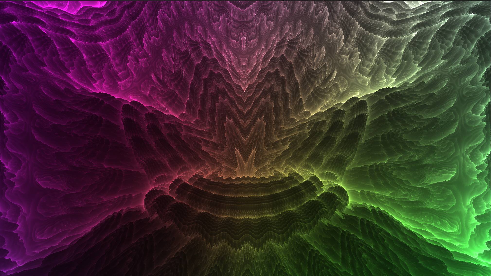
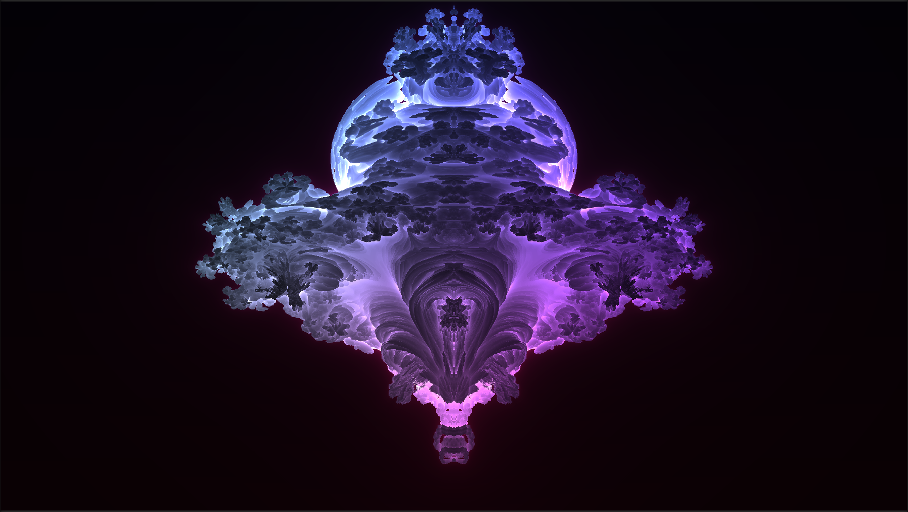
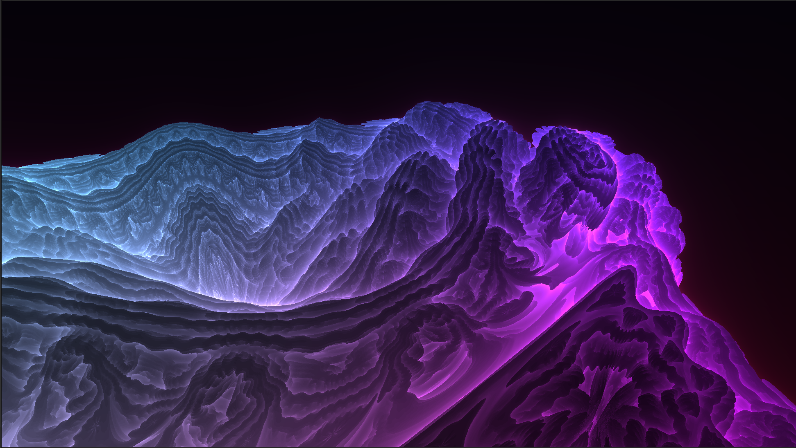
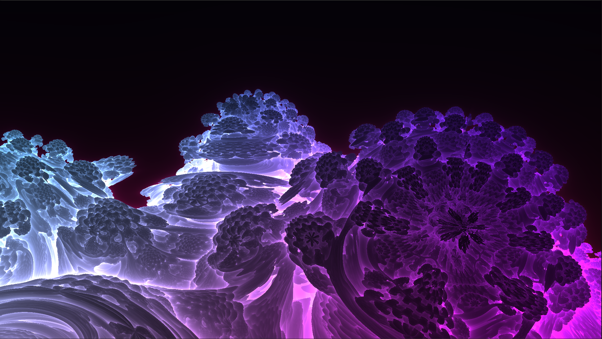
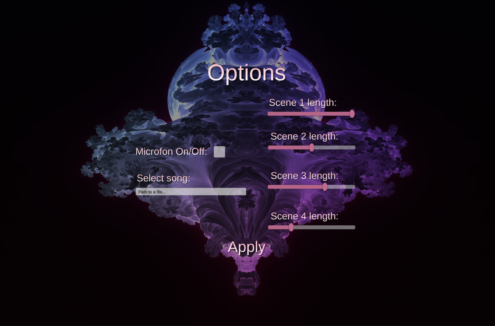

# Mandelbulb Music Visualizer

A real-time audio visualizer built in Unity that renders a 3D **Mandelbulb fractal** and animates its shape and color to
music, using ray marching on the GPU and an FFT-based audio analysis of the track (or microphone input).

This project started as a university assignment for the Faculty of Computer and Information Science, University of
Ljubljana.

⬇️ **[Download for Windows](https://github.com/pikanogavicka/mandelbulb_music_visualizer/releases/download/windows_build/FinalBuild.zip)**

▶️ **[Watch the demo video](https://youtu.be/O4ZpvVHe3BA?t=36)**



## About

The Mandelbrot set is a well-known 2D fractal, defined by the iteration `f_c(z) = z² + c`. A true three-dimensional
analogue was long thought impossible, since there is no direct 3D equivalent of the complex plane. In 2007, Daniel White
proposed rotating by spherical angles (phi, theta) instead of multiplying in the complex plane, but the resulting shapes
weren't real fractals — zooming in didn't reveal new detail. The breakthrough came from mathematician Paul Nylander, who
replaced squaring with higher powers, which produced genuine, infinitely detailed fractal geometry. At the most common
power (8), this shape is known as the **Mandelbulb**.

This project renders the Mandelbulb using **ray marching**: instead of tracing rays against simple analytic shapes (like
spheres), a distance-estimation function is evaluated repeatedly along each ray, stepping closer to the fractal surface
until a hit is registered. The fractal itself is computed on the GPU via a compute shader. 32-bit float precision is
enough to render and animate the fractal in real time at moderate zoom levels (deep zooms, as seen in many fractal
videos online, need much higher precision and can take hours or days to render, which is not viable for a live visualizer).

The music is analyzed in real time with a Fourier transform. Low and mid frequency band levels drive the fractal's shape
parameters (beat-reactive), while frequency spectrum saturation over the last couple of seconds drives its color — a
less saturated spectrum gives cooler, more monotone colors, while a richer spectrum gives warmer, more vivid ones.

## Scenes

Four scenes cycle through different viewpoints and zoom levels of the fractal. The first only plays once, at the start
of a track; the rest then loop.

1. **Formation** — shown only at the start of playback. The fractal grows from power 1 to power 8, the growth speed
   driven by the track's bass. The camera ends up facing the "Colosseum" region, where new fractal detail is constantly
   being born.
    
2. **Colosseum** — a close-up of the region the first scene ends on. Instead of increasing monotonically, the power
   oscillates around 7.5 ± 1 (as the argument of a sine function, driven by bass), giving a rippling, wave-like motion.
    
3. **Spikes** — a variant of the fractal formula that swaps cosine for sine in the polar-to-cartesian conversion,
   producing a spiky, thorn-like look. The oscillation between the two is again tied to the bass.
4. **Broccoli garden** — the bulging, self-similar protrusions nicknamed the "garden of magical broccoli" by the
   formula's original authors, which reveal further identical bulges the further you zoom in. Ray marching precision
   reacts to mid tones, giving a pulsing, inflating feel, while the fractal slowly rotates.
    

## Controls / Usage

Download the build from [Releases](../../releases) and unzip it. Run `Mandelbulb.exe` (the `Mandelbulb_Data` folder must
stay in the same directory as the executable).

In the in-app options menu you can choose whether the visualizer reacts to your **microphone** or to a **music file** on
disk. By default it visualizes "Cat People" by David Bowie.


To use your own track, enter its path in the text field. It must be a `.wav` file, and backslashes in the path must be
replaced with forward slashes, e.g.:

```
C:/Users/me/Music/song.wav
```

Click **Apply**, then **Play**.

The visualizer is fairly GPU-intensive, so expect stuttering on older or less powerful hardware.

## Tech stack

- **Unity** (C#)
- **HLSL compute shaders** for GPU ray marching of the
  fractal ([Assets/Scripts/Fractal.compute](Assets/Scripts/Fractal.compute))
- Real-time FFT audio analysis ([Assets/Scripts/AudioPeer.cs](Assets/Scripts/AudioPeer.cs))
- Fractal/shader parameter driving ([Assets/Scripts/FractalMaster.cs](Assets/Scripts/FractalMaster.cs))

## License

Original work in this repository is licensed under the **PolyForm Noncommercial License 1.0.0** — free for personal, educational, and other noncommercial use, not for commercial use. The raymarching base adapted from Sebastian Lague's project remains under its original **MIT License**. See [LICENSE](LICENSE) for the full text of both.

## Acknowledgments

- Mandelbulb formula by Daniel White and Paul Nylander
- Ray marching foundation adapted from Sebastian Lague's [Ray-Marching](https://github.com/SebLague/Ray-Marching) project (see [LICENSE](LICENSE))

## References

- D. White, ["The Unravelling of the Real-3D Mandelbulb"](https://www.skytopia.com/project/fractal/mandelbulb.html), Skytopia
- P. Nylander, ["Hypercomplex Fractals"](http://www.bugman123.com/Hypercomplex/index.html), bugman123.com
- M. Hvidtfeldt Christensen, ["Distance Estimated 3D Fractals (V): The Mandelbulb & Different DE Approximations"](http://blog.hvidtfeldts.net/index.php/2011/09/distance-estimated-3d-fractals-v-the-mandelbulb-different-de-approximations/), Syntopia, 2011
- R. Rucker, *As Above, So Below: A 3D Mandelbrot Set Story*, 2009
- S. Lague, ["Coding Adventure: Ray Marching"](https://www.youtube.com/watch?v=Cp5WWtMoeKg), YouTube, and the accompanying [Ray-Marching](https://github.com/SebLague/Ray-Marching) repository
